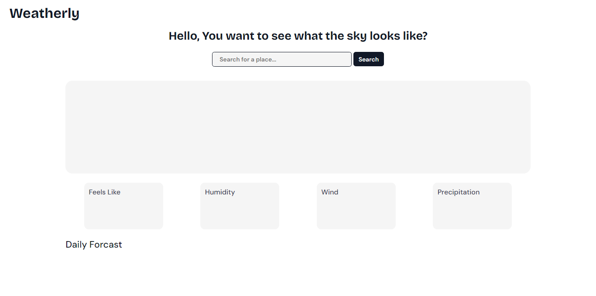
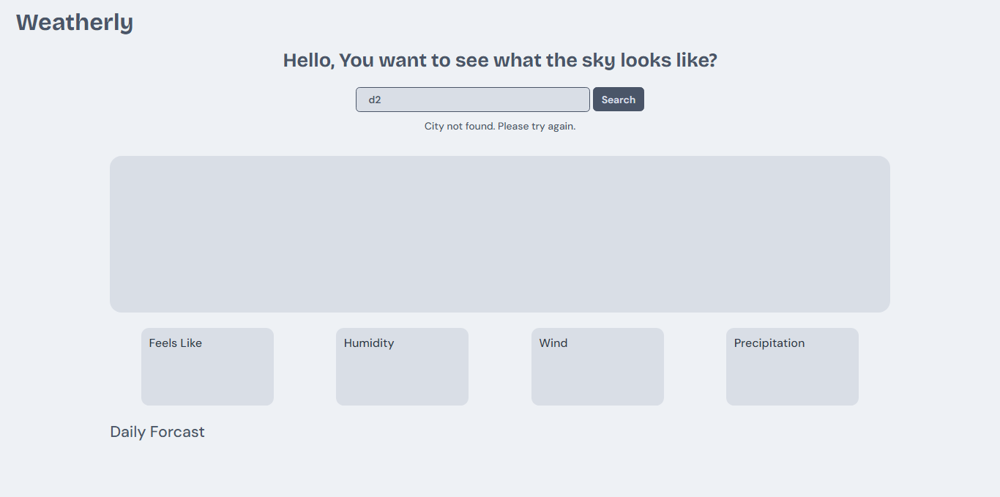
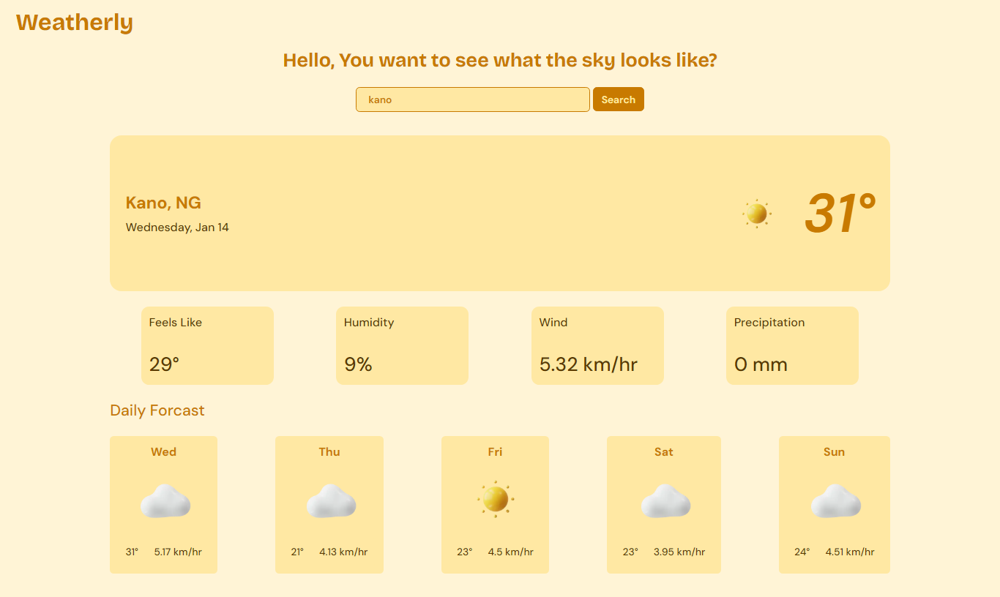
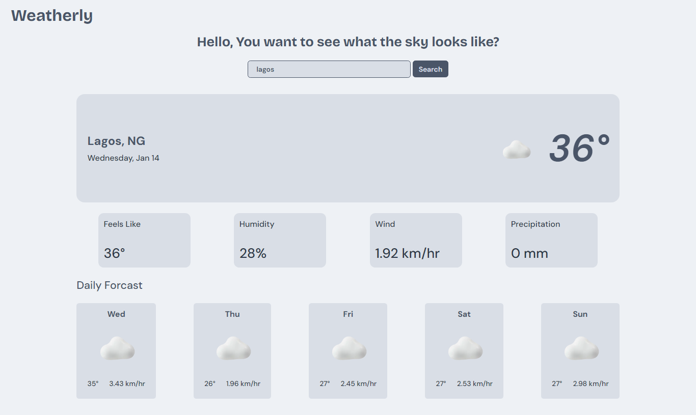
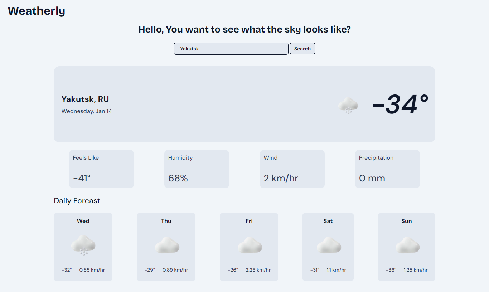

# 🌦️ Weatherly

A modern, dynamic weather web application that displays real-time weather data, daily forecasts, and adapts its theme and icons based on weather conditions.

---

## 📌 Designed By
**Okeleye Ayomide and Khaleesor Ajetunmobi**

---

## 📖 Project Overview
Weatherly is a responsive weather application that allows users to:
- View current weather conditions
- Get daily weather forecasts
- Search for weather by city name
- Automatically detect weather using location access
- Experience dynamic UI themes and icons based on weather conditions

---

## 🚀 Features
- Real-time weather data
- City-based search
- Automatic location detection
- Dynamic weather themes
- Weather-specific icons
- Daily weather forecast
- Smooth error handling
- Responsive design

---

## 🛠️ Technologies Used
- **HTML** – Page structure
- **CSS** – Styling, layout, themes, responsiveness
- **JavaScript** – Application logic and DOM manipulation
- **OpenWeather API** – Weather data source

---

## ⚙️ How It Works
1. User opens the application
2. App waits for user interaction or location permission
3. Weather data is fetched using OpenWeather API
4. JavaScript processes the response
5. DOM updates display weather information
6. Theme and icons change based on weather condition
7. Daily forecast is rendered dynamically

---

## 🎨 Theme & Icon Logic
Weather conditions returned by the API are mapped to:
- CSS theme classes
- Weather icons stored locally

This ensures consistent UI behavior across all weather types.

---

## ❗ Error Handling
- Invalid city names display an animated message within the UI
- No alert popups are used
- Application state resets gracefully

---

## 🧠 Challenges Faced
- Handling multiple weather conditions
- Icon and theme mapping
- Managing API errors
- Maintaining clean UI states
- Implementing daily forecasts

---

## ✅ Solutions
- Weather condition mapping functions
- Reusable JavaScript functions
- Template-based rendering
- CSS variables for themes
- Graceful error handling

---

## 📌 Conclusion
Weatherly is a well-structured weather application that combines real-time data, clean UI/UX design, and dynamic behavior using JavaScript and modern web technologies.
